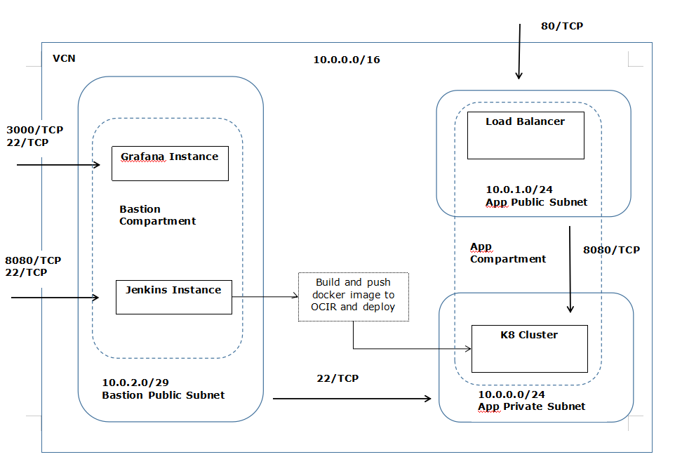

#Introduction
This repository contain terraform scripts to create resources on Oracle Cloud Infrastructure (OCI).

#Pre-requisites
* OCI Account
* Install Terraform
* Setup SSH keypair to connect with VM instances
* Create a `terraform.tfvars` file with following content and populate with corresponding information
    ```
    # Authentication
    tenancy_ocid         = "<tenancy_ocid>"
    user_ocid            = "<user_ocid>"
    fingerprint          = "<finger_print>"
    private_key_path     = "<pem_private_key_path>"
    
    # SSH Keys
    ssh_public_key  = "<public_ssh_key_path>"
    
    # Region
    region = "<oci_region>"
    ```
# Deploy
To deploy run following commands:
```
terraform init
terraform plan
terraform apply
```
# Infrastructure
The scripts will create the following resources:
* 2 Compartments (Bastion & Application)
* 1 VCN 
* 3 Subnets (public: 2, private: 1) & corresponding security lists
* 1 VM instance for Jenkins
* 1 VM instance for Grafana

